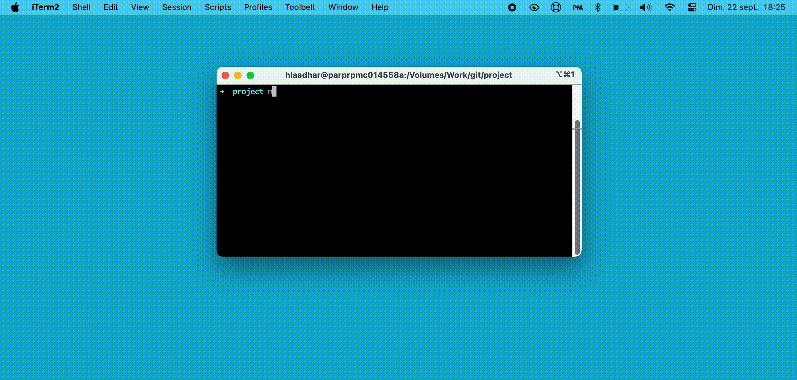

{ width="500" style="display: block; margin: 0 auto" }

WatchMe is a powerful and user-friendly process monitoring tool designed to help you keep track of running processes on your system. With WatchMe, you can easily monitor specific processes and receive notifications when they end, ensuring you stay informed about your system's activity.

## Features

- Real-time process monitoring
- Desktop notifications when monitored processes end
- Sound alerts for process termination
- User-friendly interface with process filtering
- Customizable preferences
- Tray icon for quick access and minimal interference with your workflow

## Installation

To install WatchMe, follow these steps:

1. Visit the [Releases page](https://github.com/killerwolf/watchme/releases) of the WatchMe repository.
2. Download the latest `.dmg` file for macOS.
3. Open the downloaded `.dmg` file.
4. Drag the WatchMe application to your Applications folder.
5. Launch WatchMe from your Applications folder or Spotlight.

## Usage

1. Launch WatchMe from your Applications folder.
2. The application will appear as an icon in your system tray.
3. Click on the tray icon to open the main window.
4. In the "Processes" tab, you'll see a list of running processes.
5. Use the search bar to filter processes by name.
6. Check the boxes next to the processes you want to monitor.
7. WatchMe will notify you when any of the monitored processes end.

## Preferences

You can customize WatchMe's behavior in the "Preferences" tab:

- **Auto Launch**: Enable or disable automatic launch at system startup.
- **Prefilter Regex**: Set a regular expression to filter the process list automatically.

## Contributing

We welcome contributions to WatchMe! If you'd like to contribute, please follow these steps:

1. Fork the repository.
2. Create a new branch for your feature or bug fix.
3. Make your changes and commit them with clear, descriptive messages.
4. Push your changes to your fork.
5. Submit a pull request to the main repository.

Please ensure your code adheres to the existing style and includes appropriate tests.

## Development Setup

To set up the development environment:

1. Clone the repository: `git clone https://github.com/killerwolf/watchme.git`
2. Navigate to the project directory: `cd watchme`
3. Install dependencies: `npm install`
4. Start the application in development mode: `npm start`

## Building the Application

To build the application:

1. Ensure you have all dependencies installed: `npm install`
2. Run the build script: `npm run build`

The built application will be available in the `dist` directory.

## Future Enhancements

We have several ideas for future improvements to WatchMe:

1. **Cross-platform support**: Extend compatibility to Windows and Linux.
2. **Advanced filtering options**: Implement more sophisticated process filtering capabilities.
4. **Custom notification rules**: Allow users to set up complex notification rules based on process behavior.
5. **Process grouping**: Enable users to group related processes for easier monitoring.
7. **Remote monitoring**: Add the capability to monitor processes on remote machines.
9. **Localization**: Add support for multiple languages.
10. **Dark mode**: Implement a dark theme option for the user interface.

## License

WatchMe is released under the MIT License with an additional attribution requirement. See the [LICENSE](LICENSE) file for details.

This license allows for free use, modification, and distribution of the software, but requires that any derivative work, documentation, or user interface clearly credits the original author, [@killerwolf].

## Support

If you encounter any issues or have questions, please file an issue on the [GitHub issue tracker](https://github.com/killerwolf/watchme/issues).

## Acknowledgements

WatchMe is built with Electron and uses several open-source libraries. We'd like to thank the developers of these projects for their contributions to the open-source community.
